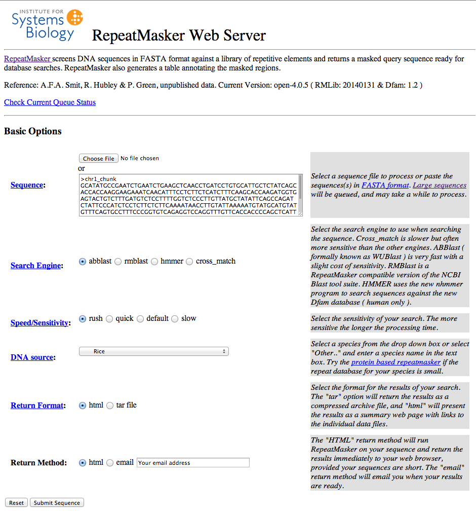

Exercise 1 - Repeats
----

### Repeat masking

In this exercise we will learn how to run RepeatMasker and interpret the results.

We will use the online version of RepeatMasker to analyse a small test sequence from the Rice genome.


#### Creating a test dataset

In this directory, there is a file called `chr1.fa`. This file contains a small section from the beginning of Rice Chromosome 1.
2. Open this file in a text editor and scroll to a random point in the sequence.
3. Copy approximately a full-screen worth of sequence to the clipboard.


#### Running RepeatMasker

We will run a very quick pass of RepeatMasker.

1. Visit the RepeatMasker website: http://www.repeatmasker.org/cgi-bin/WEBRepeatMasker
2. In the `Sequence` field write ">chr1_chunk", hit enter, then paste your copied sequence
3. Select `abblast` as the `Search Engine`
4. Set the `Speed/Sensitivity` to `rush`
5. Under `DNA source`, choose `Rice`
6. Leave both `Return Format` and `Return Method` as `html`
7. Scroll down to `Advanced Options`, and under `Masking Options`, choose `Repetitive sequences in lower case`

Your form should look something like this:



And the `Advanced Options` should look like this:


**Finally**, press `Submit Sequence`.

After a short delay (10 seconds to 2 minutes) you should see a results page.


#### Inspecting the outputs

Your results page will contain two sections.

The second section is the useful bit - a summary of the results:

```
Summary:

==================================================
file name: RM2sequpload_1400427539  
sequences:             1
total length:      14025 bp  (14025 bp excl N/X-runs) 
GC level:         48.91 %
bases masked:       6247 bp ( 44.54 %)
==================================================
               number of      length   percentage
               elements*    occupied  of sequence
--------------------------------------------------
Retroelements            1         5379 bp   38.35 %
   SINEs:                0            0 bp    0.00 %
   Penelope              0            0 bp    0.00 %
   LINEs:                0            0 bp    0.00 %
    CRE/SLACS            0            0 bp    0.00 %
     L2/CR1/Rex          0            0 bp    0.00 %
     R1/LOA/Jockey       0            0 bp    0.00 %
     R2/R4/NeSL          0            0 bp    0.00 %
     RTE/Bov-B           0            0 bp    0.00 %
     L1/CIN4             0            0 bp    0.00 %
   LTR elements:         1         5379 bp   38.35 %
     BEL/Pao             0            0 bp    0.00 %
     Ty1/Copia           0            0 bp    0.00 %
     Gypsy/DIRS1         1         5379 bp   38.35 %
       Retroviral        0            0 bp    0.00 %

DNA transposons          3          707 bp    5.04 %
   hobo-Activator        0            0 bp    0.00 %
   Tc1-IS630-Pogo        2          381 bp    2.72 %
   En-Spm                0            0 bp    0.00 %
   MuDR-IS905            0            0 bp    0.00 %
   PiggyBac              0            0 bp    0.00 %
   Tourist/Harbinger     1          326 bp    2.32 %
   Other (Mirage,        0            0 bp    0.00 %
    P-element, Transib)

Rolling-circles          0            0 bp    0.00 %

Unclassified:            0            0 bp    0.00 %

Total interspersed repeats:        6086 bp   43.39 %


Small RNA:               0            0 bp    0.00 %

Satellites:              0            0 bp    0.00 %
Simple repeats:          3          129 bp    0.92 %
Low complexity:          1           32 bp    0.23 %
==================================================

* most repeats fragmented by insertions or deletions
  have been counted as one element
                                                      

The query species was assumed to be oryza         
RepeatMasker version open-4.0.5 , rushjob mode
                                   
run with blastp version 3.0SE-AB [2009-10-30] [linux26-x64-I32LPF64 2009-10-30T17:06:09]
RepBase Update 20140131, RM database version 20140131
```

Some things to think about:

1. What proportion of your sequence was classified as repeats?
2. Are any of the repeats functionally interesting (e.g. Retroelements or transposons)?

Learn more about the functionally/evolutionarily relevant repeats:

- http://www.nature.com/scitable/topicpage/transposons-or-jumping-genes-not-junk-dna-1211
 - [ **Kejnovsky E, Hawkins JS, Feschotte C**. 2012. Plant Transposable Elements: Biology and Evolution. In Plant Genome Diversity Volume 1 (eds. J.F. Wendel, J. Greilhuber, J. Dolezel, and I.J. Leitch), pp. 17–34, Springer Vienna](http://link.springer.com/chapter/10.1007/978-3-7091-1130-7_2) \[[PDF](http://www.springer.com/cda/content/document/cda_downloaddocument/9783709111291-c1.pdf)\]
- [ **Oliver KR, McComb JA, Greene WK**. 2013. Transposable Elements: Powerful Contributors to Angiosperm Evolution and Diversity. Genome Biol Evol 5: 1886–1901.](http://dx.doi.org/10.1093/gbe/evt141)
- http://www.ndsu.edu/pubweb/~mcclean/plsc731/Transposable%20Elements%20-%202012.pdf
- [ **Tenaillon MI, Hollister JD, Gaut BS**. 2010. A triptych of the evolution of plant transposable elements. Trends in Plant Science 15: 471–478.](http://dx.doi.org/10.1016/j.tplants.2010.05.003)

#### Masked sequences

You can view the masked sequences by clicking the `Masked File:` link.

You should see your sequence with repeats converted to lower case ('masked'):

```
TGCGCCGGGTGGTCGTCGTCGGCGGGCGTGCCGGTGAGGTCGAAGTAGCG
TGGCTCGATGACGGAGAGCGCCGGGAGGAGGCCCCTGCGGGCGTGGTCGC
GGAAggcggcgtcgtagcggcggaaggtgccgcgggcggcgttggcgacg
gtgcggaggcggcggTAGAAGAGGGTGGTGGGGATGGTCTTGAAGTAGAC
CCGGTAGTCGAGGGCGTCGGCGGCGAGGGAGTCAAAGATGGTGCGCTGCG
GGTAGCCGCGGAGGAGGTTCCACTTGTCGTGGGCGACGGCGCCGTGGGAG
GTGGCGGAGTAGAGGAACAGCCGGTTGGGCTGCGTGGGCCCCGGGATGGA
GGAGAACCAGCGGTCGAACACCGCGAAGGAGGAGGCCAGCGCGGAGAAGG
CCGGGAGCCGCGACGGGGTGAACCCCCGCATGACGGCGTCGGTCAGGAGC
GCGCTCACGGAGACGGCGCTGCGGACGAAGCCCGACATGTCTGAGGGGGA
GGCGGCGGCGCCAGTAGAGTCATTGGGTCGGAACCCCAGCAGCTGCTCGA
GGACGTCCTCGAAGGCGTGGGCGGGGTCGTCGGGGACGACGAGGTCGGCG
TCGGGGGAGACGCAGTGGAGGAGGGAGTCGGCTGGACCTGGTCCTGGAGC
CGGGTTGCACTCTGCGCCGGTGAGGCCGTCGATGGGGAGGCCCAGCAGCC
GCTGCATCCACCCCAGCATGTGGTCGAACGACCGGTTCTCCAGCGCCAAC
ACCACCACGTTCTTTATCTTGGAATCCCCATTGGAATTGGGTGCCTGTGC
CAGCATTAGGAAGAGCAGCAACAGCCGCCGACCCATGGCGCCGGAATGCC
CGTGCTGCTGGAGATGCCGTCGGTGAGGAGAGAGCGGCCACATTACTAGC
TAGTGGTGTGGAGTACCAAGTACAACAAGCTAGAGAAAAAGAAAATAAAA
GATGGCGGTGGATCGATCACTTCACTAGTACAGCTGCATGCGCTGGCTTC
ATTTGGCGCCACTCACCACCTGCTCGTGTCACCCACTGCCAAGTGCTACT
GTCGATGTTTCTACCTTCTCGCTTAATAACAATCACGATTTCTGTATTAA
GTAAATACTCTCTCTATCCCATAGTATAAGGGATTTCATATAGATATGAC
GCATTCTAATAGAATAGATAGAGTGATGTATTTCTAATAGAATAGATCTG
TATAGATAAACTATTATAGAGTGATGTATTTTATGTTATTAATTCTAGTA
CAATATATCTTATTTATTCTTTAtactccatctgtcccaaaatataagga
attttgagtggatgagacgtattctagtactataaatctggacatattta
ctgtctagatttgaaatattaaaatgcgccataatcaactaaaactcctt
atatttatagacagagagagtaACTATTTAAATGGTACGTAAGAAACAAC
ACGAGATGAACTCATAAAAATACTTCCCCACTGCCGCTTCCTTTAGGGAG
CAATGTTGTTCTAGCCTTGCATATGGATGTGGTGGCGACAGCCGAATCGA
TTATGTATGTACTCCGGCGAAGTTTGTTGTGTTGTGCCGTTTGAAGATGC
AGTGGCCCTGTAGTTACGCTGCATGTGACAGGTACAAACAAACTGGCCGA
CCTACATATGTCAAACAGATTGCCCGCCGTTGTTGGTTCACGGGCTTATT
GAGATGGGATTGGGAAGCTGCCCACCCGTTCTCTCGTTAATTGTTGCTCC
TATTATGTACAAGTATTAGCTATCTGCCTATCTCTATCTCAGAGACTCAG
ACTGAGTTCCTGCTTCTGTTCTTTGTTTCAGAGCTGGTACTTAGAAACCT
GAGTTTTATTCTCAGCCCCtgtttggatcccctcaaatttttcatcctgt
catatcgaacgtttgaacactgtatgaagtattaaatataggctaaaaaa
taactaattaccaaattacgactaatttatgagacaaatcttttaatcct
aattgctccatgatttgataatgtggctacagtaaatatttgctaatgat
ggattaattaggcttaataaattcatctcacggtttacttacggattctg
taattagtttttttatcagtgtccgaacaccccatacgacaccctatata
atattcgatgtgacacgccaaaactttacactcctgatctaaacaCCCTC
TGAATGTCTGAGACAGTGCCCACTCTGTGCTATAAACTTTGTGAGTGAGT
TTTTACCCAGCGCTCCCCCCGTTTGGGCTTTCAATATAAGCTGGGTCTCT
GACCTCTCTAAAAAAAGGTATGTATTACAACTTAATTGATAAAACAATTA
CATTACTTATACAAGTAGTTGTAGAAAATACTACATCCATCTAAAAATGA
CGAACGTCATAAAAAAGCAAAGGGAGGATCATGTGTTGTCATTGATAAAA
AAAAGTAGATTAAAAATGTTCAATCCGATTTACCCCATCAACTATCGTAA
AAAGATAGATATACCCTCCTCAACTATGGTATGTACAGGGATGCACGTGG
GCCGGGTTAACCCATGTACCCAGCGACCCAGCCCACGATACATGGGGTCA
AAACCTCGTGGGCTTATCCATGAAATTTCATGGGTCATCATGGGCTGACC
```

Look closely at the sequences that were identified as repeats and compare them to the surrounding sequence. How different do they look? Could you pick out the repetitive sequence by eye? Do you think the RepeatMasker algorithm has captured the repeats perfectly?

In a real genome annotation project, and when you use a genome annotation in your own experiments, you should always bear in mind that the process is imperfect.

#### Annotation table output

Take a look at the annotation file in your browser by clicking the `Annotation File:` link.

#### Adjusting the parameters

The quality of the repeat database and the type of algorithm used will greatly affect the accuracy of the results.

To demonstrate this, re-run the previous analysis on the RepeatMasker website but change some parameters:

1. select Arabidopsis or Maize as the reference species - you should see many fewer predicted repeats.
2. select a more sensitive alignment option
3. select a different BLAST

How different are these results from our first analysis? Which factor makes the biggest difference?