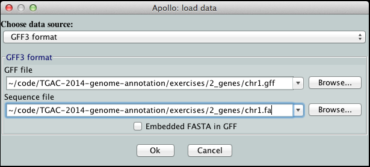
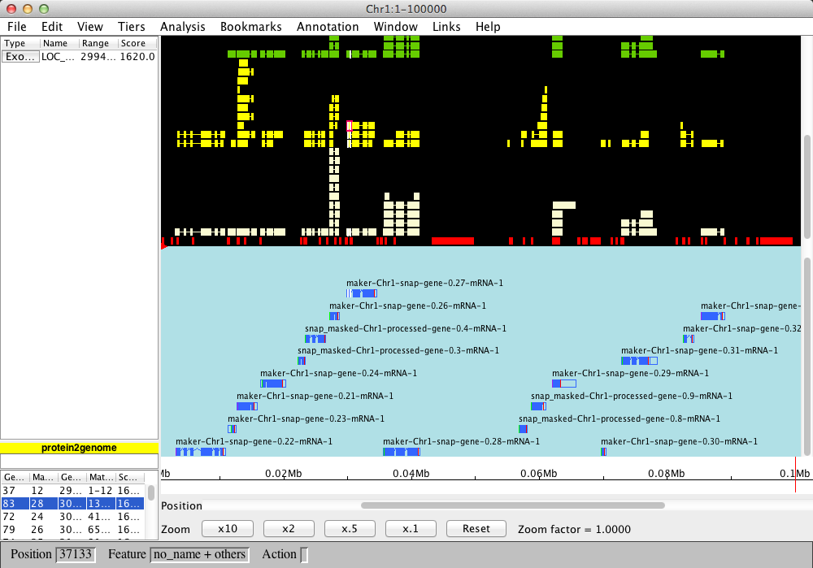

Exercise 2 - Genes
----

In this exercise we will examine the results of gene prediction using several different methods. This will demonstrate:

- how evidence is accumulated during annotation
- the varying results of different prediction methods
- the effects of different evidence types

In this directory are two files:

- `chr1.fa` - a snippet of sequence from Rice chromosome 1 in FASTA format
- `chr1.gff` - a GFF3 format file containing the evidence from various gene prediction steps

### Directly examine the evidence trail

Although most people will view annotations in genomic context with a genome viewer, it is worth remembering that the GFF3 file format is human-readable and useful on its own. When running an annotation pipeline you will most likely have to check the GFF3 file repeatedly.

Open `chr1.gff` in a text editor. You should see lines like this:

```
Chr1	maker	exon	72816	73935	.	+	.	ID=maker-Chr1-snap-gene-0.31-mRNA-1:exon:2;Parent=maker-Chr1-snap-gene-0.31-mRNA-1
Chr1	maker	exon	74468	74981	.	+	.	ID=maker-Chr1-snap-gene-0.31-mRNA-1:exon:3;Parent=maker-Chr1-snap-gene-0.31-mRNA-1
Chr1	maker	exon	75619	77203	.	+	.	ID=maker-Chr1-snap-gene-0.31-mRNA-1:exon:4;Parent=maker-Chr1-snap-gene-0.31-mRNA-1
Chr1	maker	exon	77325	78349	.	+	.	ID=maker-Chr1-snap-gene-0.31-mRNA-1:exon:5;Parent=maker-Chr1-snap-gene-0.31-mRNA-1
Chr1	maker	five_prime_UTR	72816	72902	.	+	.	ID=maker-Chr1-snap-gene-0.31-mRNA-1:five_prime_utr;Parent=maker-Chr1-snap-gene-0.31-mRNA-1
Chr1	maker	CDS	72903	73935	.	+	0	ID=maker-Chr1-snap-gene-0.31-mRNA-1:cds;Parent=maker-Chr1-snap-gene-0.31-mRNA-1
Chr1	maker	CDS	74468	74981	.	+	2	ID=maker-Chr1-snap-gene-0.31-mRNA-1:cds;Parent=maker-Chr1-snap-gene-0.31-mRNA-1
Chr1	maker	CDS	75619	77008	.	+	1	ID=maker-Chr1-snap-gene-0.31-mRNA-1:cds;Parent=maker-Chr1-snap-gene-0.31-mRNA-1
```

Go to [the GFF3 validator] and check your GFF3 file is valid.

### Summarising the GFF3

Because GFF3 is a simple tab-delimited text format, it can be summarised at the command-line. The powerful GNUtools that come with Linux make this easy.

Open a Terminal and move to the directory for the exercise:

```bash
cd ~/TGAC-2014-genome-annotation/exercises/2_genes
```

Suppose you wanted to check which programs had been used so far in an annotation. This information is contained in column two of the GFF3 format. Use the `cut` tool to extract this information:

```bash
cut -f2 chr1.gff | sort | uniq
```

You should see:

```
.
blastn
blastx
est2genome
maker
protein2genome
repeatmasker
snap_masked
```

If you didn't recognise the name of a particular program in the list, you might want to find out what type of annotation each program had contributed. The annotation type is in column three. Use `cut` again:

```bash
cut -f2,3 chr1.gff | sort | uniq
```

This results in:

```
.	contig
blastn	expressed_sequence_match
blastn	match_part
blastx	match_part
blastx	protein_match
est2genome	expressed_sequence_match
est2genome	match_part
maker	CDS
maker	exon
maker	five_prime_UTR
maker	gene
maker	mRNA
maker	three_prime_UTR
protein2genome	match_part
protein2genome	protein_match
repeatmasker	match
repeatmasker	match_part
snap_masked	match
snap_masked	match_part
```

Now you can see that `blastn` and `est2genome` were used to align expressed sequences (mRNAs/cDNAs), while `blastx` and `protein2genome` were used to align proteins. `maker` has created gene, exon, mRNA, CDS and UTR predictions - these are the gene models, suggesting `maker` was the actual annotation pipeline (which is correct). It's not clear from the annotation type what `repeatmasker` or `snap_masked` did. We know `repeatmasker` from the last exercise, and `snap` is a de-novo gene predictor.

So in this one file we have repeats, evidence from both mRNA and proteins, de-novo gene predictions as well as gene models created by the `maker` pipeline.

### View the evidence in genomic context

Let's see what these different annotations look like when displayed on the sequence itself - we'll use the Apollo genome viewer.

Open the Terminal and run the following command to open the Apollo genome viewer:

```
apollo
```

- Select `GFF3 format` as the data source
- Enter the paths to the GFF3 file and the sequence FASTA file into their respective fields
	- GFF3: `~/TGAC-2014-genome-annotation/exercises/2_genes/chr1.gff`
	- Sequence: `~/TGAC-2014-genome-annotation/exercises/2_genes/chr1.fa`
	- note: you may need to type the full path to your home directory



Press 'Ok'

You should see the Apollo browser view:



- The scale, in base pairs, is displayed in the centre. Forward strand is above, and reverse strand below.
- The area with the light blue background displays gene models.
- The area with the black background displays evidence tiers. Hovering over this area, you can scroll up and down to show more evidence tiers. Each tier is coloured to indicate its type.
- The white area at the bottom is the evidence panel - it shows details of selected tiers.

You can select any object with your mouse, and you can scroll horizontally to move along the genome.

The view is quite crowded, but gives an overview. We can make some more space for a closer look:

- Moving the evidence panel (at the bottom) to the side by pressing `Ctrl V`
- Hide the reverse strand by pressing `Ctrl R`.

Now, you can examine a gene in detail. Select a gene model object in the blue pane, then press `Ctrl Z` to zoom to it. You can zoom further using the buttons at the bottom until you are in sequence view. When you select an object in the evidence tiers, its corresponding region on the genome will be highlighted. At the same time, the program used to produce that evidence will be shown in the evidence panel.

Compare the different evidence tiers. Do they match up with one another? How well does the gene model match the different evidence tiers? Which do you believe?

Some things to think about:

- How well does the SNAP (de-novo gene predictor) tier match the other evidence? What kinds of things are different?
- The red and green tier right at the top of the black panel shows start (green) and stop (red) codons. Do these perfectly correspond to the gene models?
- Zoom in to the sequence view and right-click the genome. Choose 'colour sequences by splice site potential'. This colours the canonical splice site acceptors. Do the marked splice sites consistently match up with the intron-exon boundaries in the gene models and the evidence tiers?

When you have finished exploring, keep Apollo open as we will use it in the next exercise.
