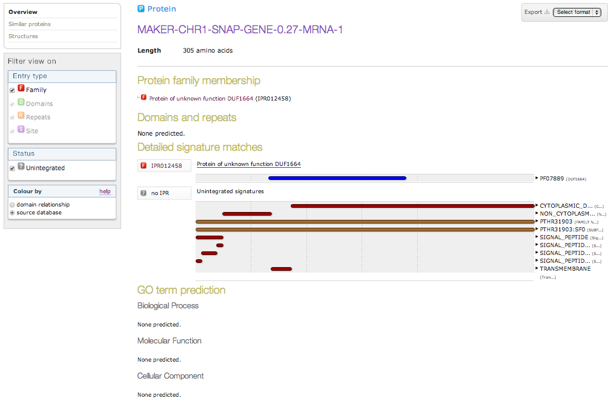

Exercise 3 - Function
----

In this exercise we will use annotate some of our predicted gene models with putative function based on their similarity to known sequences.

For this we will use the InterPro database provided by the EBI. InterPro is a curated database that combines many other curated and automated protein, motif, domain and sequence databases into one tool, grouping proteins into families and providing a single search tool to annotate sequences.

The search tool, InterProScan, is available standalone and is a standard tool used during annotation of a freshly assembled genome. Given some input amino acid sequences, InterProScan will compare them to various databases and return matches and functional classifications such as:

- Homology to known proteins
- Protein domains
- Transit peptides
- GO ontology

Because the standalone tool takes a very long time to run, we will use the web tool at http://www.ebi.ac.uk/interpro/ to annotate specific sequences predicted by our structural annotation. The web tool runs InterProScan and provides a nice graphical display of the results.

### Extract predicted sequence from your structural annotation

You should still have the Apollo browser open from exercise 2 (if not, go back and work through ex. 2).

One way we can be reasonably confident in a gene model prediction is if the whole predicted product has a highly significant sequence alignment to known products. Another is if a large portion of the predicted protein sequence matches known domains.

Pick a gene model from those visible that you would like to functionally annotate. Select your chosen gene model in the light blue pane by double-clicking it. The gene model will be outlined in red. Right-click and select `Sequence...`:

Make sure 'Peptide sequence' is selected, then copy the amino acid sequence including the FASTA definition line.

Now visit the InterPro website (http://www.ebi.ac.uk/interpro/), paste your sequence into the query field, and press `Search`.

Your query might take a couple of minutes to run, and then you should see a results page:

Examine your results - are there any functinal annotations? If there are none, does this adjust your confidence in the gene model? If there are functional annotations, what can you deduce about the possible function of this gene?

If there were GO terms assigned to your sequence, go to [AmiGO](http://amigo.geneontology.org/amigo) to visualise the GO heirarchy for those terms.

In the example shown above, no specific function has been predicted and no known domains have been identified. However, there are various detailed signature matches that reveal that this is likely to be a membrane-spanning protein with one cytoplasmic side, a transmembrane region, one non-cytoplasmic side and a signal peptide.
